# Architecture: Data Flow & Operational Logic

Visual companion to `README.md` (deployment/configuration) and
`docs/user-guide.md` (end-user features). This file documents **how the
system actually works** — what moves data where, and what decisions each
component makes.

Diagrams are [Mermaid](https://mermaid.js.org/), which GitHub renders
natively in Markdown — no build step, no generated image assets to keep in
sync with the source. Edit the code blocks directly.

## Contents

- [1. System topology](#1-system-topology) — containers, networks, volumes
- [2. Level-0 data flow](#2-level-0-data-flow) — FCC to end user
- [3. Ingestion: daily catch-up logic](#3-ingestion-daily-catch-up-logic)
  - [3a. The poll cycle](#3a-the-poll-cycle)
  - [3b. The ingest job](#3b-the-ingest-job)
- [4. Parsing: file to record](#4-parsing-file-to-record) — FCC's three delimiter hazards
- [5. Ingestion: per-row decision logic](#5-ingestion-per-row-decision-logic)
- [6. Notification pipeline](#6-notification-pipeline)
- [7. Delivery lifecycle](#7-delivery-lifecycle) — retry/failure states
- [8. Passwordless authentication](#8-passwordless-authentication)
- [9. Test-send](#9-test-send)
- [10. Read-request lifecycle](#10-read-request-lifecycle)
- [11. MCP server](#11-mcp-server) — LLM/agent access
- [12. Data model](#12-data-model)
- [13. Deployment: update.sh](#13-deployment-updatesh)
- [14. Operational runbook](#14-operational-runbook) — install & recovery

---

## 1. System topology

Ten containers on one rootless Podman host, on a single internal network
(`fcculs`). **Only `web` publishes a host port** — everything else is
reachable only from inside the network, by container DNS name.

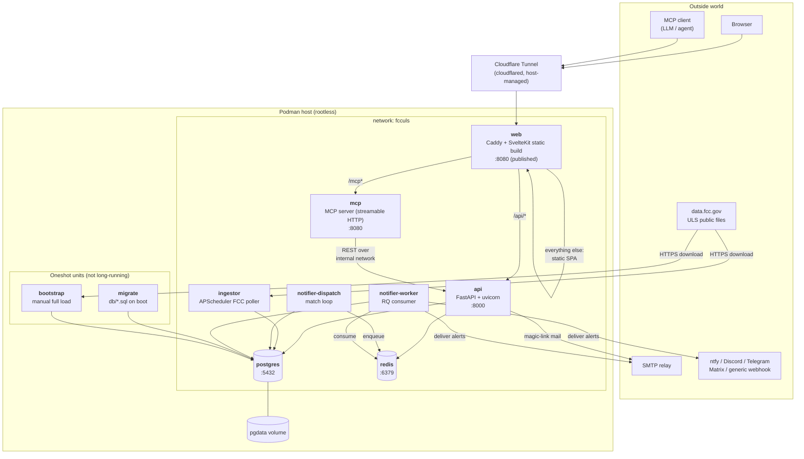

**Why the notifier is two containers.** Matching (DB-only, fast, must not
block) is deliberately separated from sending (network-bound, slow,
needs retries). `dispatch` loops on `DISPATCH_INTERVAL_SECONDS`; one or
more `worker` processes drain the queue independently. Neither can stall
the other.

---

## 2. Level-0 data flow

The two independent paths through the system: **ingest** (scheduled,
write) and **serve** (on-demand, read), joined only by Postgres.

```mermaid
flowchart LR
    fcc[/"FCC ULS<br/>weekly dumps +<br/>daily transaction files"/]

    subgraph ingestpath["Ingest path — polled (~15 min), writes"]
        dl["download<br/>+ unzip"]
        parse["parse<br/>pipe-delimited .dat"]
        diff["diff vs<br/>current DB row"]
        upsert["upsert"]
        events["emit<br/>change_events"]
    end

    db[("PostgreSQL")]

    subgraph servepath["Serve path — on-demand, reads"]
        rest["REST API"]
        spa["SvelteKit SPA"]
    end

    subgraph alertpath["Alert path — event-driven"]
        match["match events<br/>against watches"]
        send["render + deliver"]
    end

    fcc --> dl --> parse --> diff
    diff --> upsert --> db
    diff --> events --> db

    db --> rest --> spa --> enduser["End user<br/>(browser)"]
    db --> match --> send --> enduser2["End user<br/>(email/SMS/webhook)"]

    style ingestpath fill:#1f2933,stroke:#3e4c59
    style servepath fill:#1f2933,stroke:#3e4c59
    style alertpath fill:#1f2933,stroke:#3e4c59
```

`change_events` is the pivot: it is simultaneously the user-visible
"Change History" on detail pages **and** the trigger source for all
alerting. Nothing else feeds alerts.

The `parse` and `diff` boxes above are each expanded in detail below:
[§4](#4-parsing-file-to-record) covers turning a `.dat` file into records,
and [§5](#5-ingestion-per-row-decision-logic) covers what happens to each
record once parsed.

---

## 3. Ingestion: daily catch-up logic

The most subtle logic in the system. **FCC daily files are named by
weekday only** (`l_am_mon.zip`), are **overwritten in place on a 7-day
rotation**, and each is published **~05:00–13:00 UTC the day *after* the
weekday it is named for**.

So the naive approach — derive today's filename from today's weekday —
fetches a file that has not been refreshed yet and therefore still holds
**the same weekday from the previous week**. That was a real bug in this
project; see `docs/plan.md`'s Progress Log.

The scheduler instead treats filenames as opaque and derives the true
date from each file's `Last-Modified` header.

### 3a. The poll cycle

The scheduler does not run at a fixed time of day. FCC's publication
schedule is irregular, so a single daily run meant a file published even
slightly after that run time waited roughly a full day. Instead the
ingestor **polls every `INGEST_POLL_MINUTES`** (default 15).

Polling naively would mean 5 services × 7 weekday files = **35 HEAD
requests per poll, ~3,360/day** against a government server. It does not:
FCC publishes a browsable directory listing that carries filename,
timestamp and exact size for every file at once, and it honours
`If-Modified-Since` on that listing. So a steady-state poll is **one
conditional GET returning `304 Not Modified` with an empty body**.

| Mode | Requests/poll | Requests/day |
|---|---|---|
| Old daily cron | 35 | 35 |
| Naive 15-minute per-file sweep | 35 | ~3,360 |
| Poll, caught up | 1 (a 304) | ~96 |
| Poll, waiting on a publication | 1 + ≤5 | ~340 |

Two properties of that listing are load-bearing and non-obvious, and both
were confirmed against the live server rather than assumed:

- **`If-None-Match` is not honoured.** Sending FCC's own ETag back returns
  `200` and the full body. Only `If-Modified-Since` produces a `304`. The
  "obvious" ETag implementation would silently transfer everything on
  every poll while appearing to work.
- **Listing timestamps are US Eastern, not UTC.** They are converted with
  `ZoneInfo("America/New_York")`, never a fixed offset — a constant −4
  would pass every test writable in summer and then misdate every file
  after the November DST change.
- **The listing is a static `index.html`, not live autoindex output**, and
  it can lag the files it describes by hours. Index-only polling therefore
  *cannot* guarantee detection within one interval — which is the whole
  objective. Hence the hybrid: the listing is the cheap primary signal,
  and the poller still issues targeted `HEAD`s for the handful of dates it
  knows are still outstanding.
- **The listing is regenerated hourly at ~:15 UTC** even when no ULS file
  changed. One poll an hour therefore legitimately sees a `200`; the other
  three in that hour see `304`s. A `:15` `200` is not a broken conditional
  request.

Correctness never rests on the 304. What gets ingested is decided by the
`ingest_runs` table; the listing only decides how cheaply that decision
can be reached. If FCC's caching behaviour changes, polling gets more
expensive, not wrong.

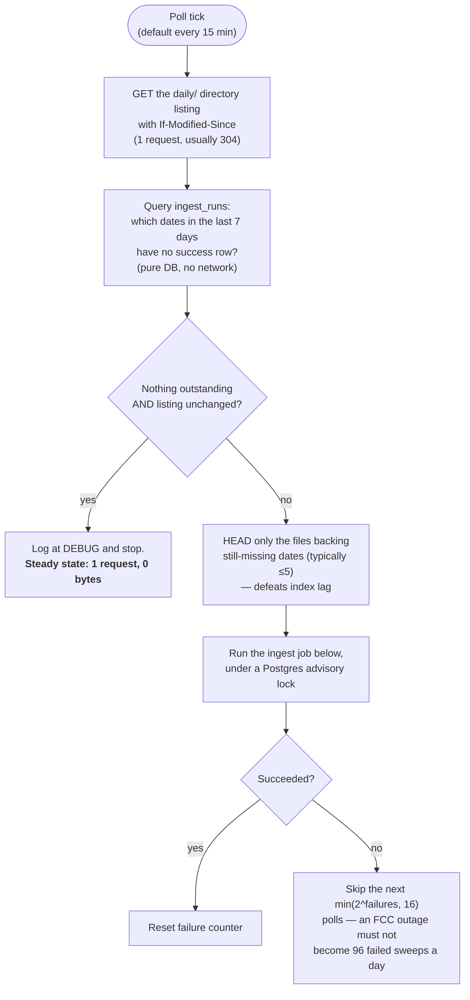

Every `INGEST_FULL_SWEEP_MINUTES` (default 60) the 304 fast path is
ignored and all files are re-checked directly, covering FCC re-publishing
an older weekday file without the listing reflecting it.

Weekly complete dumps (`l_amat.zip`, `r_tower.zip`, …) are **observed**,
not auto-loaded: a new dump is recorded in `complete_dumps` and reported
by `--status`. Applying one is still a deliberate `--bootstrap`.

The ingest phase is wrapped in `pg_try_advisory_lock`. `change_events` has
no unique constraint and the differ compares against the *currently
stored* row, so two overlapping ingests of the same day would each emit a
full set of change events — and those feed the notifier, so the
user-visible symptom would be **duplicate alerts**. Under a once-a-day
cron that was nearly impossible; at 15-minute polling a slow run
overlapping the next tick, or a poll racing an operator's manual
`--catch-up`, is plausible. `try_` rather than blocking is deliberate: a
poll that finds an ingest already running should step aside, not queue
behind it and then redo the work.

### 3b. The ingest job

```mermaid
flowchart TD
    start(["Ingest job starts<br/>(from a poll tick, or --catch-up)"]) --> svc{"For each service:<br/>amateur, tower, gmrs,<br/>aircraft, ship<br/>(or just those named<br/>by --service)"}

    svc --> head["Read all 7 weekday files' timestamp<br/>+ size from the cached listing;<br/>HEAD only what the listing can't settle"]
    head --> resolve["Resolve each file's real data date:<br/>walk back from Last-Modified to the<br/>first matching weekday"]

    resolve --> undated{"Date<br/>resolvable?"}
    undated -->|"no — missing or<br/>unparseable header"| fallback["Fall back to the archive's own<br/><b>counts</b> member: File Creation Date<br/>equals Last-Modified exactly"]
    fallback --> stillno{"Still<br/>undateable?"}
    stillno -->|"yes"| skipfile["Log warning, defer file<br/>(never guess; retried next poll)"]
    stillno -->|"no"| known
    undated -->|"yes"| known

    known["Query ingest_runs for<br/>dates already loaded"] --> pending["pending = available<br/>− already ingested<br/>− outside 7-day window"]

    pending --> any{"Any<br/>pending?"}
    any -->|"no"| nothing["Log 'nothing to do'<br/>— no download at all"]
    any -->|"yes"| loop["For each pending date,<br/><b>oldest first</b>"]

    loop --> dlday["Download + extract<br/>into its own temp dir"]
    dlday --> ingestday["ingest_file per .dat member<br/><b>effective_date = real data date</b>,<br/>not the run date"]
    ingestday --> verify["Compare rows ingested per file against<br/>FCC's own <b>counts</b> member<br/>(mismatch → WARNING + status='partial',<br/>never a refusal to ingest)"]
    verify --> record["INSERT ingest_runs<br/>(service, data_date, sha256, counts, status)"]
    record --> more{"More<br/>pending?"}
    more -->|"yes"| loop
    more -->|"no"| done

    skipfile --> known
    nothing --> done
    done{"Anything<br/>ingested?"} -->|"yes"| refresh["REFRESH MATERIALIZED VIEW<br/>identity_by_frn, towers_by_site,<br/>entities_by_address"]
    done -->|"no"| skiprefresh["Skip refresh<br/>(nothing changed)"]

    refresh --> fin(["Run complete"])
    skiprefresh --> fin
```

**Properties this buys us:**

| Property | Mechanism |
|---|---|
| **Self-healing** | A missed run is picked up automatically next time, as long as the day is still inside FCC's rolling 7-day window. |
| **Idempotent** | `ingest_runs` has `UNIQUE (service, data_date)`; an already-loaded day is skipped *without downloading*. Row-level upserts mean even a forced re-ingest cannot double-count. |
| **Correctly dated** | `effective_date` comes from the file's resolved date, so change history and the New Hams feed line up with reality. |
| **Partial-failure safe** | Each day gets its own temp dir and its own `ingest_runs` row, so a failure mid-catch-up keeps every earlier day recorded. |
| **Ordered** | Oldest-first means multi-day catch-ups apply chronologically, so diffs are computed against the correct prior state. |

### 3c. Operational heartbeats

`ingest_runs` and `complete_dumps` only get a new row when there's
actually something to record — so a genuinely quiet FCC publishing
period (an empty weekend daily file, entirely normal) and a silently
dead poller loop are otherwise indistinguishable from the database
alone. `service_heartbeats` (`db/011_ops_heartbeats.sql`) closes that
gap: one row per background loop, upserted **unconditionally on every
cycle** regardless of outcome —

- `ingestor-poll`, written at the very top of `run_poll_cycle()`, before
  any of its exit paths (backoff-skip, steady-state 304/nothing-
  outstanding, normal ingest, or failure).
- `notifier-dispatch`, written at the end of `dispatch.run_once()`,
  whether or not any deliveries were enqueued.

Because the write happens unconditionally, heartbeat *staleness* alone
proves the loop itself stopped running — a distinct and more urgent
condition than "ran, but found nothing new." The admin panel's Overview
tab (`GET /api/admin/ops-summary`) surfaces both heartbeats' age
alongside per-service ingest status, new-hams activity, signups, and
notification delivery counts, classifying each heartbeat as `ok` /
`stale` / `down` / `unknown` using multiples of the loop's own configured
interval (`INGEST_POLL_MINUTES`, `DISPATCH_INTERVAL_SECONDS`) — see the
README's "Admin Panel" section.

> **Hard limit:** FCC keeps only 7 rotating files. A gap longer than that
> is **unrecoverable from the daily feed** — it needs a fresh
> `--bootstrap`. See [§14](#14-operational-runbook).

---

## 4. Parsing: file to record

How a `.dat` file becomes the "one parsed record" §5 starts from. FCC's
files are pipe-delimited with **no quoting or escaping of any kind**,
which produces three hazards that a naive line-oriented reader handles
silently wrongly. All three were found in real production data — see
`docs/fcc-data-reference.md` §5b for the measurements.

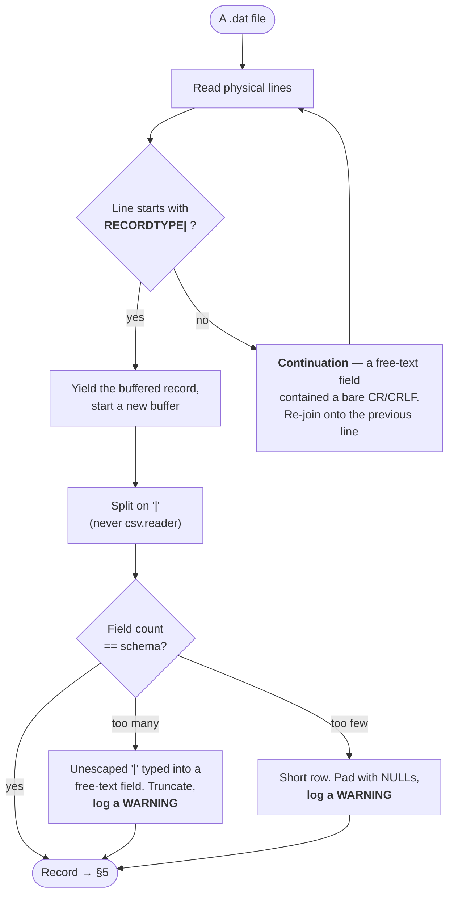

**Why the record-type prefix, not the line, defines a record.** Ship's
`SV.dat` embeds bare `CR`/`CRLF` inside its free-text voyage
descriptions: 389 of its 1,068 physical lines are continuations. Reading
line-by-line yielded 970 rows, 291 of them malformed; prefix-aware
reassembly yields the correct 679. Every other file currently has zero
continuations, but the logic is applied **generically** because the cost
is negligible and the failure mode is silent corruption.

**Why `split("|")` and never `csv.reader`.** Python's CSV module treats a
leading `"` as quoting syntax, so a value like `"inland waters"` gets
rewritten, and it re-splits exactly the embedded newlines that
reassembly just repaired. FCC does not quote, so neither do we.

**Why malformed rows are tolerated but never silent.** A pipe typed into
a free-text field (e.g. `Director of Safety | Charter Ops Manager`) is
*unparseable in principle* — nothing records where the real boundaries
were. Affected rows are truncated/padded rather than aborting a 5.6M-row
load, but each one logs a warning. At current scale this is 17 rows
across all services, so `validate_schema.py` uses a 0.1% mismatch
tolerance: high enough to ignore this known noise, low enough that a
genuine layout change still fails loudly.

---

## 5. Ingestion: per-row decision logic

What happens to a single parsed record. The `generate_diffs` flag is the
top-level fork: bootstrap loads take a batched fast path that emits **no**
change events (otherwise a fresh install would fire hundreds of thousands
of bogus "new license" alerts).

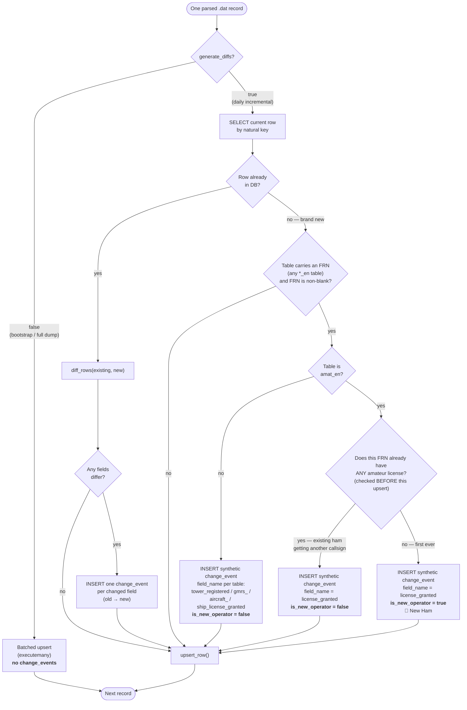

**Three non-obvious rules encoded here:**

1. **Brand-new rows produce no field-level diffs.** `diff_rows()` returns
   nothing when there is no prior row — otherwise every field would read
   as "changed from nothing." But that would leave a new licensee's first
   grant firing *no event at all*, so a single **synthetic** event is
   emitted instead. This is what makes "watch by FRN before you have a
   callsign" work.
2. **`is_new_operator` is computed once, at ingest, and never revisited.**
   It is checked *before* the row's own upsert, so the record cannot see
   itself. Storing it durably (rather than deriving it live) means it can
   never retroactively flip when that person later earns a second/vanity
   callsign — the celebration is a permanent historical fact.
3. **`is_new_operator` is structurally Amateur-only.** Only the `amat_en`
   branch can ever set it true, so a GMRS/aircraft/ship grant cannot leak
   into the New Hams celebration no matter how the data looks. There is
   an explicit test asserting this for each of the three services.

---

## 6. Notification pipeline

From a stored `change_event` to a message in someone's inbox. Matching and
sending are separate processes joined by a Redis queue.

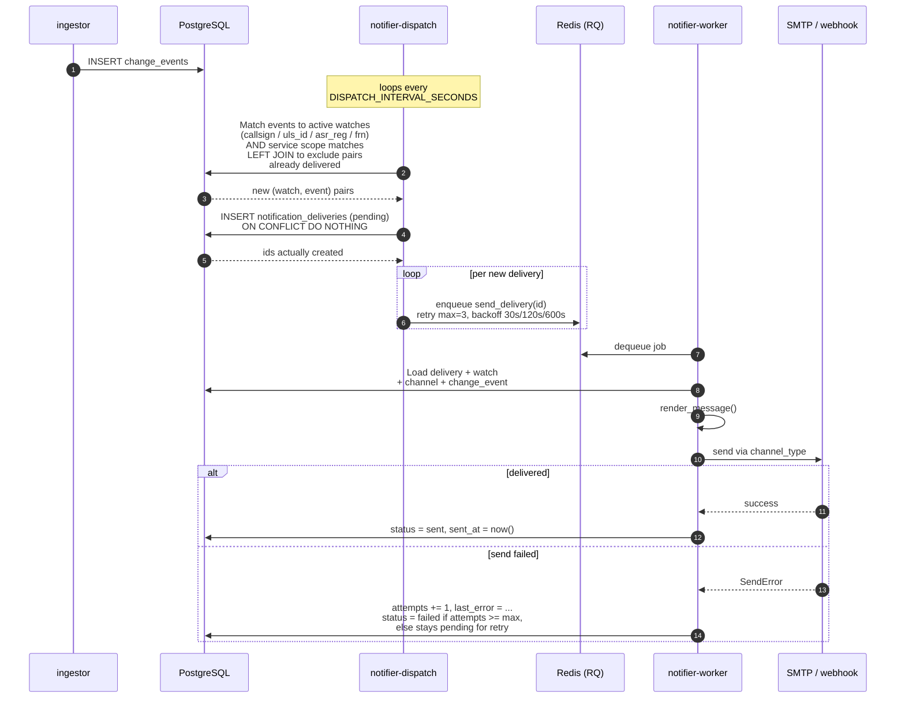

**Double idempotency guard.** Matching excludes pairs that already have a
delivery row (`LEFT JOIN ... WHERE nd.id IS NULL`), *and* the insert uses
`ON CONFLICT DO NOTHING` against a unique constraint on
`(watch_id, change_event_id)`. Only ids actually returned by `RETURNING`
get enqueued — so two dispatch runs racing each other cannot double-send.

**Optional service scope.** A watch may be narrowed to one service
(`amateur`, `tower`, `gmrs`, `aircraft`, `ship`) via
`AND (w.service IS NULL OR w.service = ce.service)`. `NULL` means "any
service", so every watch created before services existed keeps matching
exactly as it did. The asymmetry is deliberate: a *scoped* watch never
fires on an event whose own `service` is NULL (i.e. recorded before the
column existed), because an event of unknown service can't be confirmed
to be in scope.

---

## 7. Delivery lifecycle

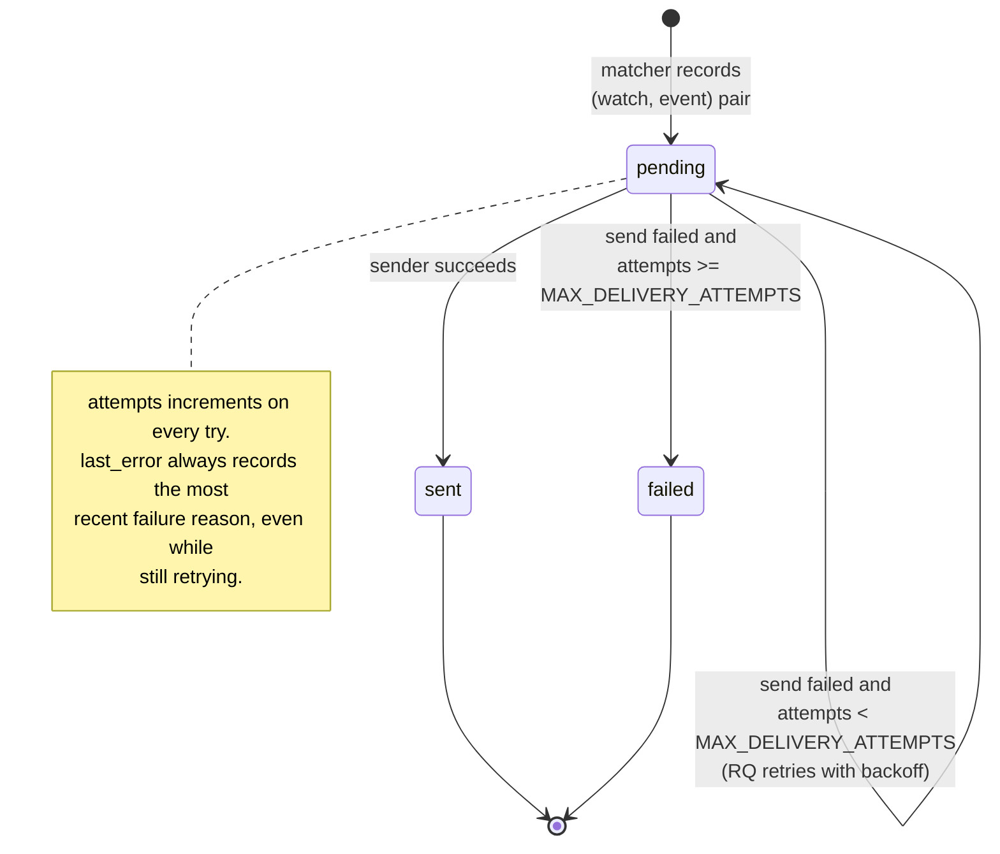

Unknown `channel_type`, or a channel deleted mid-flight, fails the
delivery immediately with a recorded reason rather than retrying — there
is nothing a retry could fix.

---

## 8. Passwordless authentication

No passwords are stored or transmitted. A single-use, hashed, expiring
token is emailed; possession of the mailbox is the proof of identity.

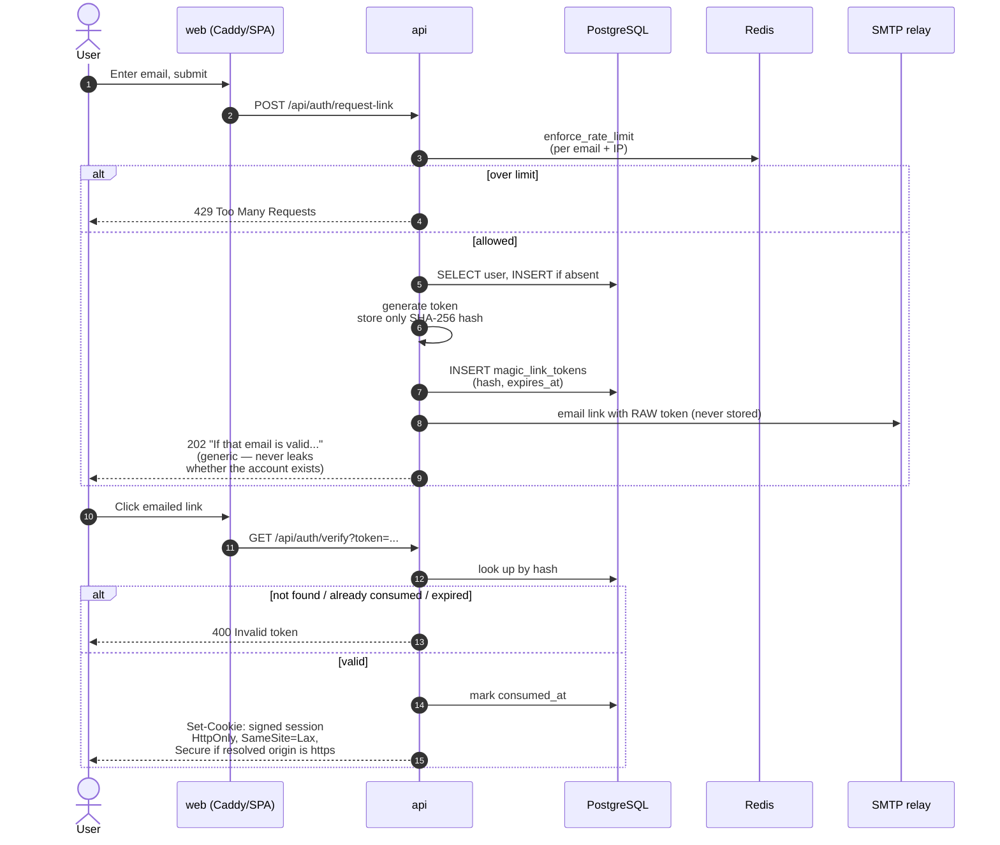

**Host-header hardening.** The base URL used in the emailed link and the
cookie's `Secure` decision is derived from `X-Forwarded-Host`/
`X-Forwarded-Proto` (so the app works behind any tunnel hostname without
config drift) — **but only if the resolved origin is in the operator's
`CORS_ALLOW_ORIGINS` allow-list.** Otherwise it falls back to the static
configured base URL. Without that check, an attacker could supply a
crafted `Host` header and have it echoed into a real user's magic-link
email.

---

## 9. Test-send

Lets a user prove a channel works before relying on it. Notable because
the `api` and `notifier` are **separate containers with separate
codebases** — the job is referenced across that boundary by *string path*,
not an imported function.

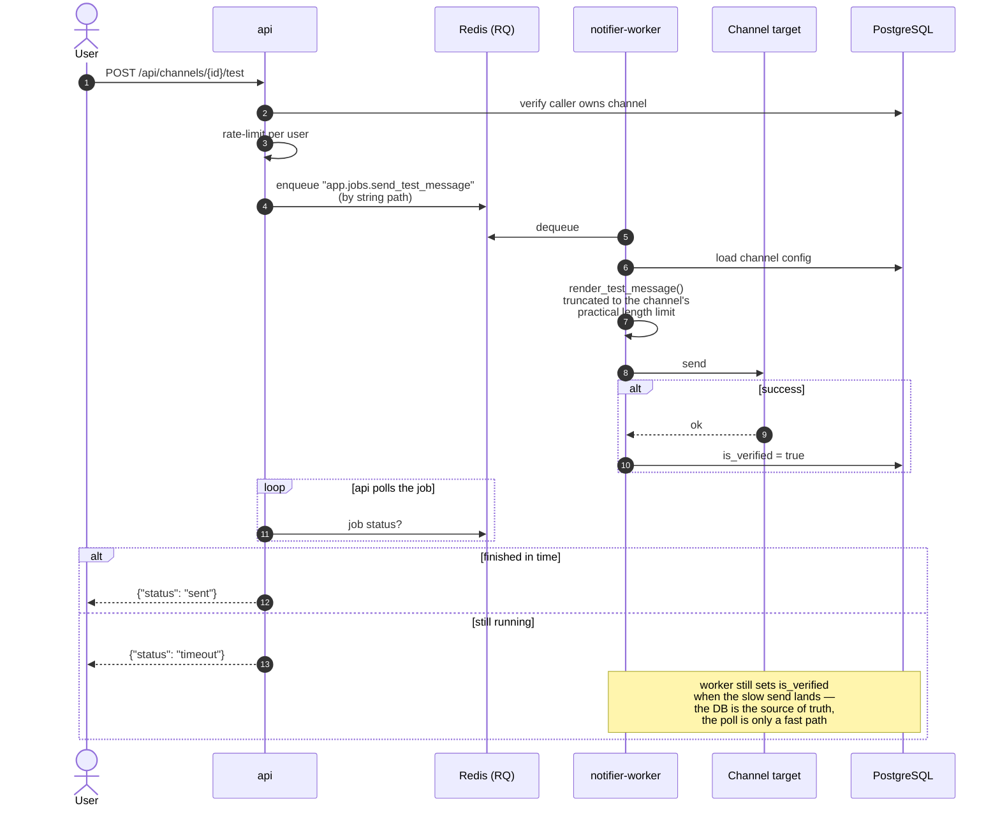

A real ntfy.sh POST was observed taking ~11s during live testing, longer
than the API's poll window — hence the worker, not the API, owns the
`is_verified` write.

---

## 10. Read-request lifecycle

Every public page load. Caddy is the only entry point; it splits static
assets from API calls.

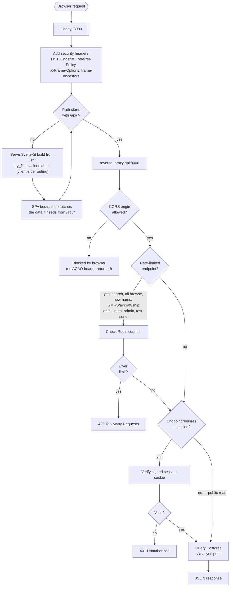

**Detail-endpoint limiting is now uniform.** Every public read endpoint —
browse *and* detail, across Amateur, Tower, GMRS, Aircraft and Ship —
calls `enforce_rate_limit` on the shared search tier
(`RATE_LIMIT_SEARCH_MAX` per `RATE_LIMIT_SEARCH_WINDOW_SECONDS`, default
60/60s, keyed per client IP in Redis). The older
`GET /api/amateur/{call_sign}` and `GET /api/towers/{registration_number}`
endpoints were the last gap and were closed as a prerequisite for the MCP
server, since MCP tool calls reach those same endpoints unauthenticated.

Because the MCP server calls the API over the internal network, **every
MCP tool call is limited by the same counter as a browser request** — the
MCP layer adds no limiting of its own and needs none. Note the practical
consequence: all MCP traffic shares one client IP (the `mcp` container's),
so heavy agent use is throttled as a single client rather than per end
user.

---

## 11. MCP server

The `mcp` container exposes the same read-only data to LLM clients and
agents over the Model Context Protocol, so a tool like Claude Desktop or
Copilot CLI can answer questions about FCC licence data directly.

**It contains no database access at all.** It is a protocol adapter: it
translates MCP tool calls into REST calls against the existing `api`
container and reshapes the JSON responses. That is deliberate — it means
query logic, validation, rate limiting and connection pooling exist in
exactly one place, and the MCP surface cannot drift from what the website
shows.

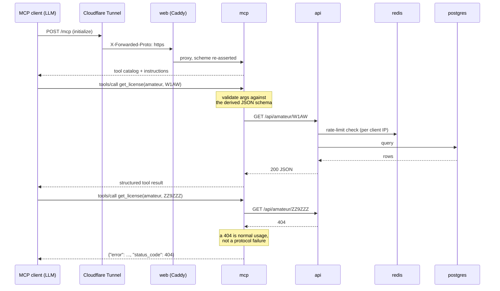

### The eleven tools

| Tool | Backing endpoint |
|---|---|
| `search_uls` | `GET /api/search` |
| `browse_licenses(service=…)` | `/api/amateur`, `/api/gmrs`, `/api/aircraft`, `/api/ship` |
| `get_license(service=…, call_sign=…)` | the matching detail endpoint |
| `browse_towers` / `get_tower` | `/api/towers[/{n}]` |
| `get_identity_by_frn` | `GET /api/identity/frn/{frn}` |
| `get_identity_by_address` | `GET /api/identity/address` |
| `get_change_history` | `GET /api/history` |
| `get_new_hams` | `GET /api/new-hams` |
| `describe_code` | `GET /api/field-definitions/describe` |
| `list_field_definitions` | `GET /api/field-definitions` |

Browse and detail are unified across the four licence services behind a
single `service` enum rather than one tool per service. Eleven tools
describe the whole dataset instead of twenty-odd near-duplicates, which
keeps the catalog small enough for a model to reason about — and the enum
makes the valid values self-documenting.

**Service-specific filters are routed, not merged.** `operator_class` is
Amateur-only, `n_number` Aircraft-only, `ship_name`/`mmsi` Ship-only. The
API rejects unknown query parameters, so forwarding an aircraft filter to
the GMRS endpoint would turn an ignorable argument into a hard failure.
The tool layer drops filters that don't apply to the chosen service.

### Two failure modes worth knowing

Both are silent from inside the network and only appear when testing
through the real public hostname:

1. **DNS-rebinding protection returning `421`.** The SDK arms a localhost
   allowlist if you pass no transport-security settings, and rejects
   everything if you pass a bare `TransportSecuritySettings()`. Both
   implicit paths are wrong behind a proxy, so the setting is configured
   explicitly.
2. **Protocol-downgrade redirect.** The SDK mounts at `/mcp` and redirects
   `/mcp/` → `/mcp`. Cloudflare terminates TLS and reaches Caddy over plain
   HTTP, so unless the real scheme is re-asserted, that redirect is emitted
   as `http://` and clients refuse to follow it. See the comments in
   `web/Caddyfile`.

### Page sizes

`MCP_DEFAULT_PAGE_SIZE` (10) and `MCP_MAX_PAGE_SIZE` (50) are deliberately
smaller than the website's 25/100. Tool results are consumed by a model
with a finite context window, where a large page is actively harmful
rather than merely slow.

---

## 12. Data model

Three groups: **FCC raw tables** (mirror the public files), **application
tables** (users, watches, delivery), and **derived objects** (materialized
views for identity grouping). `change_events` is the bridge between the
FCC side and the application side.

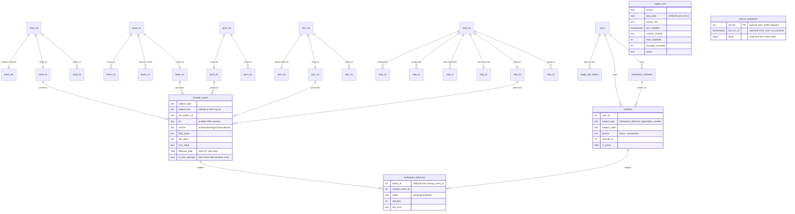

Materialized views (refreshed at the end of any ingest that wrote data):

| View | Groups by | Powers |
|---|---|---|
| `identity_by_frn` | FRN | "all licenses and towers for this identity" — unions all five services, so one FRN shows a person's entire FCC footprint |
| `towers_by_site` | rounded lat/lon | "other structures at this site" |
| `entities_by_address` | normalized mailing address | "related licensees" (all five services) |

---

## 13. Deployment: update.sh

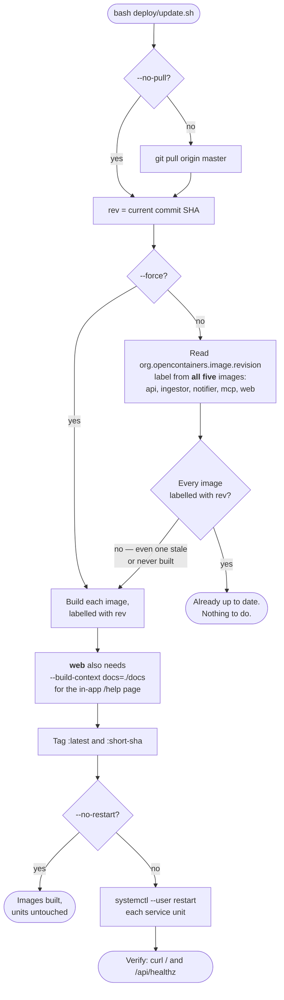

**Why all five labels are checked.** Images build sequentially, so a
failure partway through can leave `api` correctly labelled while `web` is
stale. Checking only `api` (the original behaviour) made a retry report
"Already up to date" and leave a never-successfully-built image in place
indefinitely. See `docs/plan.md`'s Progress Log.

---

## 14. Operational runbook

### Fresh install

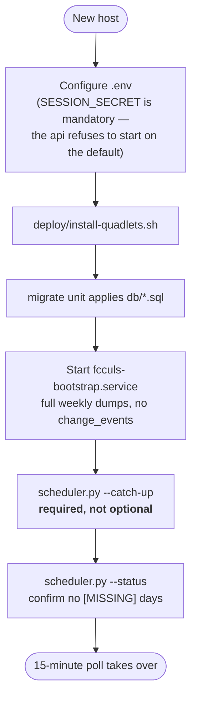

> The weekly dump is cut once a week, so on any day but publication day it
> is **already 1–6 days stale on arrival**. Skipping the `--catch-up` step
> is the single most likely way a new instance silently starts life with a
> data gap and an empty New Hams feed.

> **Adding a service to an existing install.** `--bootstrap`, `--catch-up`
> and `--status` all accept a repeatable `--service NAME` flag
> (`amateur`, `tower`, `gmrs`, `aircraft`, `ship`); with none given they
> operate on all five. This is how a running instance loads a newly added
> dataset without re-downloading or disturbing the services it already
> has:
> `--bootstrap --service gmrs --service aircraft --service ship`, then
> the same `--service` set with `--catch-up`. The new tables are unread by
> the API until its image ships, so a partial load cannot affect what
> users currently see.

### Diagnosing a suspected gap

### Backup and restore

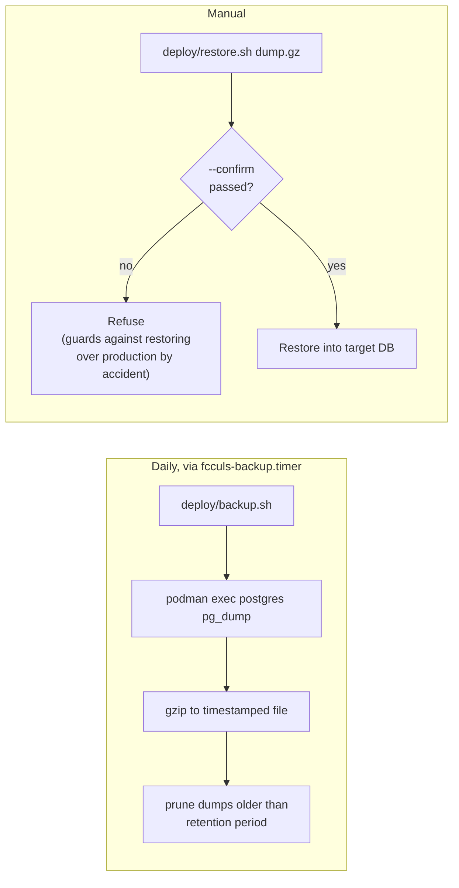

Ingested FCC data is always re-downloadable. **User accounts, watches, and
notification-channel configs are not** — they exist only in Postgres,
which is what the backup protects.
