# Architecture: Data Flow & Operational Logic

Visual companion to `README.md` (deployment/configuration) and
`docs/user-guide.md` (end-user features). This file documents **how the
system actually works** — what moves data where, and what decisions each
component makes.

Diagrams are [Mermaid](https://mermaid.js.org/), which GitHub renders
natively in Markdown — no build step, no generated image assets to keep in
sync with the source. Edit the code blocks directly.

## Contents

- [1. System topology](#1-system-topology) — containers, networks, volumes
- [2. Level-0 data flow](#2-level-0-data-flow) — FCC to end user
- [3. Ingestion: daily catch-up logic](#3-ingestion-daily-catch-up-logic)
- [4. Ingestion: per-row decision logic](#4-ingestion-per-row-decision-logic)
- [5. Notification pipeline](#5-notification-pipeline)
- [6. Delivery lifecycle](#6-delivery-lifecycle) — retry/failure states
- [7. Passwordless authentication](#7-passwordless-authentication)
- [8. Test-send](#8-test-send)
- [9. Read-request lifecycle](#9-read-request-lifecycle)
- [10. Data model](#10-data-model)
- [11. Deployment: update.sh](#11-deployment-updatesh)
- [12. Operational runbook](#12-operational-runbook) — install & recovery

---

## 1. System topology

Nine containers on one rootless Podman host, on a single internal network
(`fcculs`). **Only `web` publishes a host port** — everything else is
reachable only from inside the network, by container DNS name.

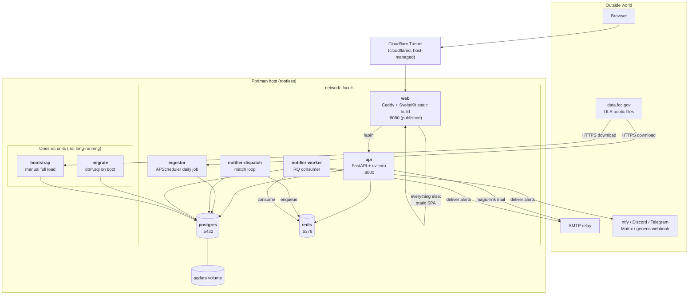

**Why the notifier is two containers.** Matching (DB-only, fast, must not
block) is deliberately separated from sending (network-bound, slow,
needs retries). `dispatch` loops on `DISPATCH_INTERVAL_SECONDS`; one or
more `worker` processes drain the queue independently. Neither can stall
the other.

---

## 2. Level-0 data flow

The two independent paths through the system: **ingest** (scheduled,
write) and **serve** (on-demand, read), joined only by Postgres.

`change_events` is the pivot: it is simultaneously the user-visible
"Change History" on detail pages **and** the trigger source for all
alerting. Nothing else feeds alerts.

---

## 3. Ingestion: daily catch-up logic

The most subtle logic in the system. **FCC daily files are named by
weekday only** (`l_am_mon.zip`), are **overwritten in place on a 7-day
rotation**, and each is published **~05:00–13:00 UTC the day *after* the
weekday it is named for**.

So the naive approach — derive today's filename from today's weekday —
fetches a file that has not been refreshed yet and therefore still holds
**the same weekday from the previous week**. That was a real bug in this
project; see `docs/plan.md`'s Progress Log.

The scheduler instead treats filenames as opaque and derives the true
date from each file's `Last-Modified` header.

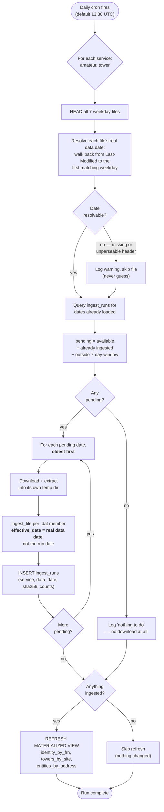

**Properties this buys us:**

| Property | Mechanism |
|---|---|
| **Self-healing** | A missed run is picked up automatically next time, as long as the day is still inside FCC's rolling 7-day window. |
| **Idempotent** | `ingest_runs` has `UNIQUE (service, data_date)`; an already-loaded day is skipped *without downloading*. Row-level upserts mean even a forced re-ingest cannot double-count. |
| **Correctly dated** | `effective_date` comes from the file's resolved date, so change history and the New Hams feed line up with reality. |
| **Partial-failure safe** | Each day gets its own temp dir and its own `ingest_runs` row, so a failure mid-catch-up keeps every earlier day recorded. |
| **Ordered** | Oldest-first means multi-day catch-ups apply chronologically, so diffs are computed against the correct prior state. |

> **Hard limit:** FCC keeps only 7 rotating files. A gap longer than that
> is **unrecoverable from the daily feed** — it needs a fresh
> `--bootstrap`. See [§12](#12-operational-runbook).

---

## 4. Ingestion: per-row decision logic

What happens to a single parsed record. The `generate_diffs` flag is the
top-level fork: bootstrap loads take a batched fast path that emits **no**
change events (otherwise a fresh install would fire hundreds of thousands
of bogus "new license" alerts).

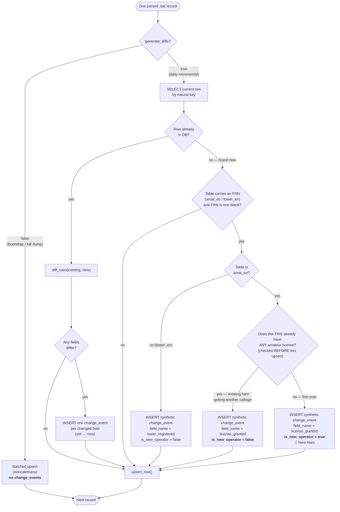

**Two non-obvious rules encoded here:**

1. **Brand-new rows produce no field-level diffs.** `diff_rows()` returns
   nothing when there is no prior row — otherwise every field would read
   as "changed from nothing." But that would leave a new licensee's first
   grant firing *no event at all*, so a single **synthetic** event is
   emitted instead. This is what makes "watch by FRN before you have a
   callsign" work.
2. **`is_new_operator` is computed once, at ingest, and never revisited.**
   It is checked *before* the row's own upsert, so the record cannot see
   itself. Storing it durably (rather than deriving it live) means it can
   never retroactively flip when that person later earns a second/vanity
   callsign — the celebration is a permanent historical fact.

---

## 5. Notification pipeline

From a stored `change_event` to a message in someone's inbox. Matching and
sending are separate processes joined by a Redis queue.

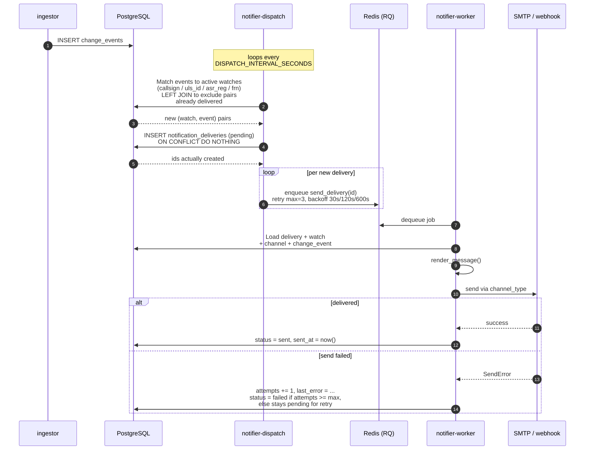

**Double idempotency guard.** Matching excludes pairs that already have a
delivery row (`LEFT JOIN ... WHERE nd.id IS NULL`), *and* the insert uses
`ON CONFLICT DO NOTHING` against a unique constraint on
`(watch_id, change_event_id)`. Only ids actually returned by `RETURNING`
get enqueued — so two dispatch runs racing each other cannot double-send.

---

## 6. Delivery lifecycle

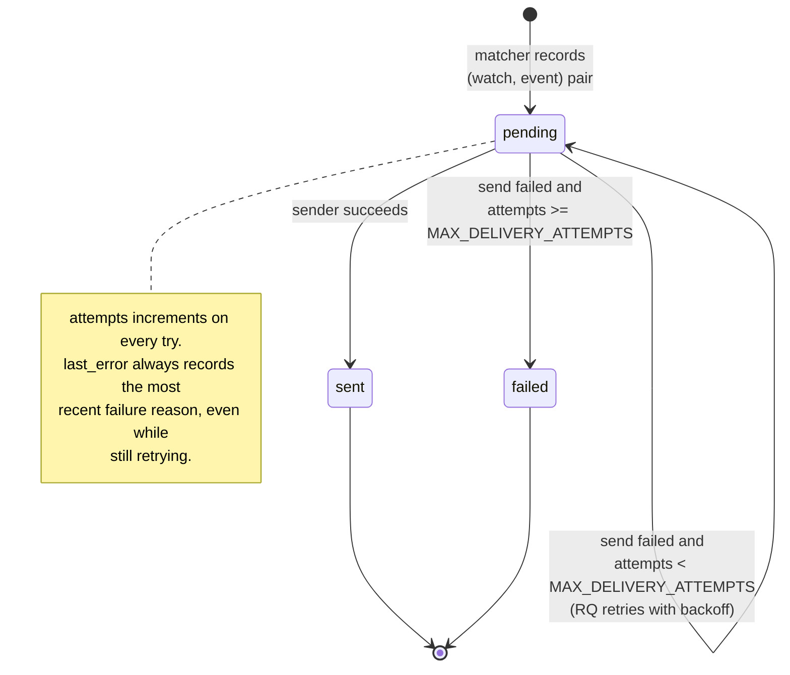

Unknown `channel_type`, or a channel deleted mid-flight, fails the
delivery immediately with a recorded reason rather than retrying — there
is nothing a retry could fix.

---

## 7. Passwordless authentication

No passwords are stored or transmitted. A single-use, hashed, expiring
token is emailed; possession of the mailbox is the proof of identity.

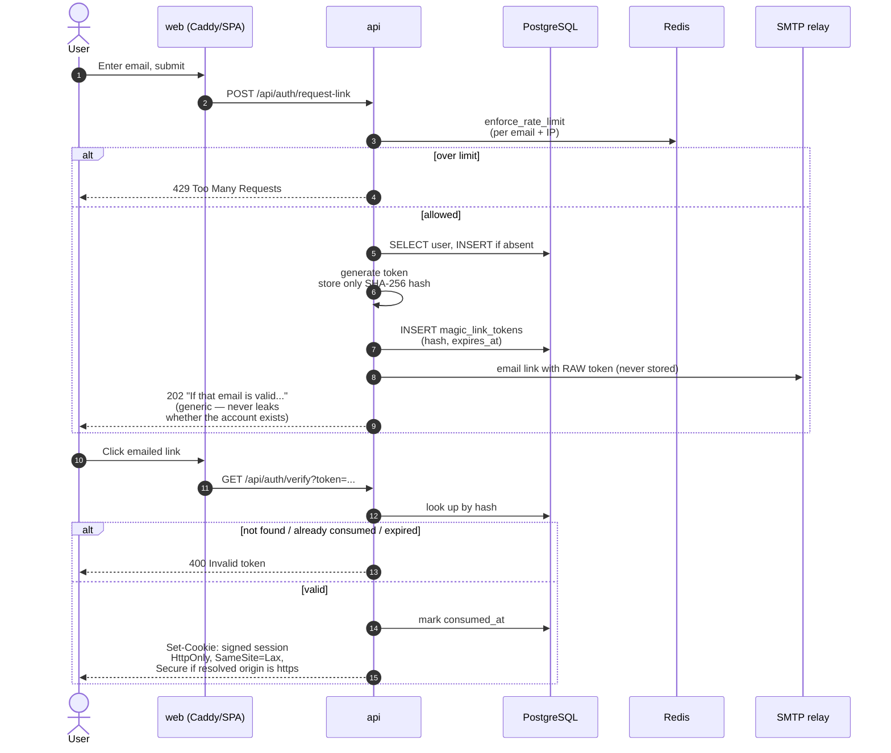

**Host-header hardening.** The base URL used in the emailed link and the
cookie's `Secure` decision is derived from `X-Forwarded-Host`/
`X-Forwarded-Proto` (so the app works behind any tunnel hostname without
config drift) — **but only if the resolved origin is in the operator's
`CORS_ALLOW_ORIGINS` allow-list.** Otherwise it falls back to the static
configured base URL. Without that check, an attacker could supply a
crafted `Host` header and have it echoed into a real user's magic-link
email.

---

## 8. Test-send

Lets a user prove a channel works before relying on it. Notable because
the `api` and `notifier` are **separate containers with separate
codebases** — the job is referenced across that boundary by *string path*,
not an imported function.

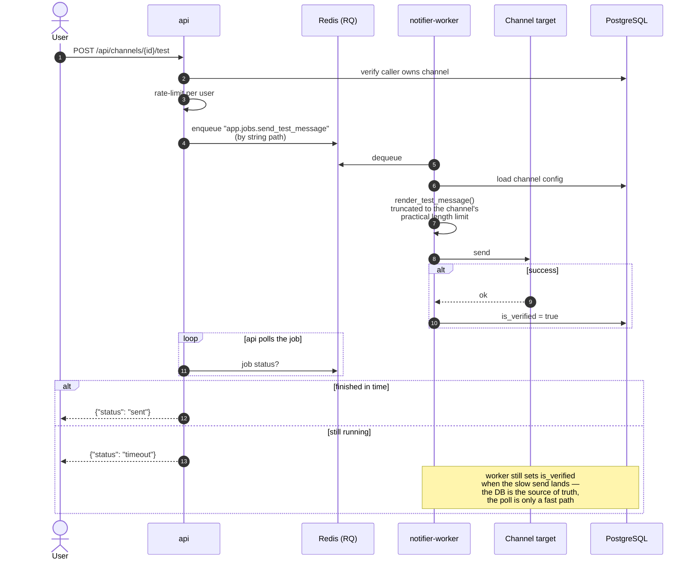

A real ntfy.sh POST was observed taking ~11s during live testing, longer
than the API's poll window — hence the worker, not the API, owns the
`is_verified` write.

---

## 9. Read-request lifecycle

Every public page load. Caddy is the only entry point; it splits static
assets from API calls.

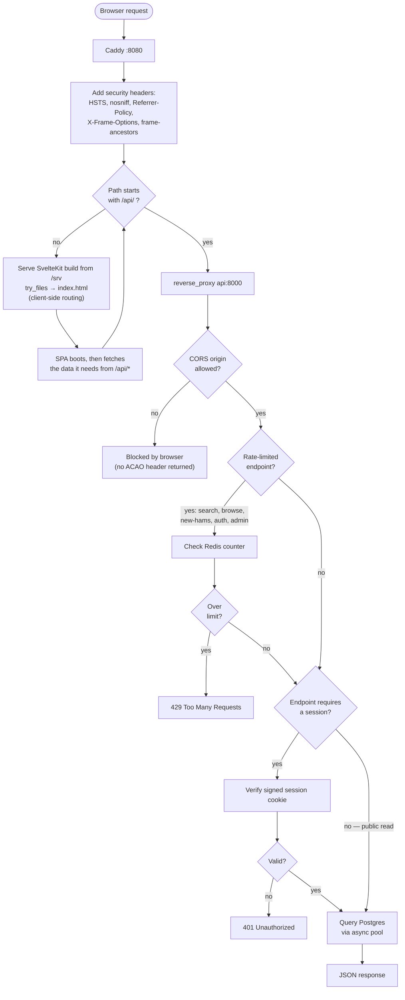

---

## 10. Data model

Three groups: **FCC raw tables** (mirror the public files), **application
tables** (users, watches, delivery), and **derived objects** (materialized
views for identity grouping). `change_events` is the bridge between the
FCC side and the application side.

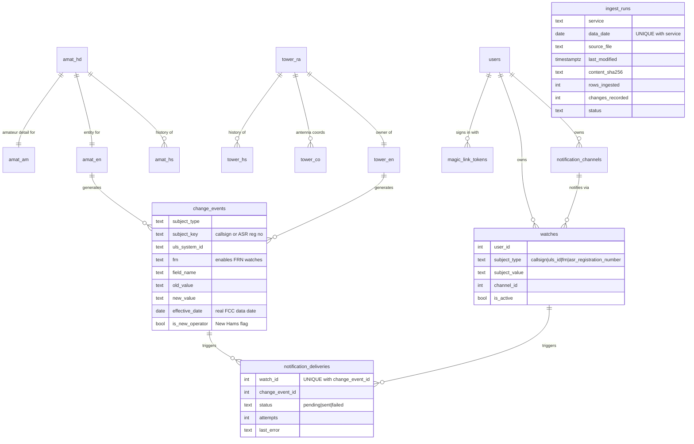

Materialized views (refreshed at the end of any ingest that wrote data):

| View | Groups by | Powers |
|---|---|---|
| `identity_by_frn` | FRN | "all licenses and towers for this identity" |
| `towers_by_site` | rounded lat/lon | "other structures at this site" |
| `entities_by_address` | normalized mailing address | "related licensees" |

---

## 11. Deployment: update.sh

**Why all four labels are checked.** Images build sequentially, so a
failure partway through can leave `api` correctly labelled while `web` is
stale. Checking only `api` (the original behaviour) made a retry report
"Already up to date" and leave a never-successfully-built image in place
indefinitely. See `docs/plan.md`'s Progress Log.

---

## 12. Operational runbook

### Fresh install

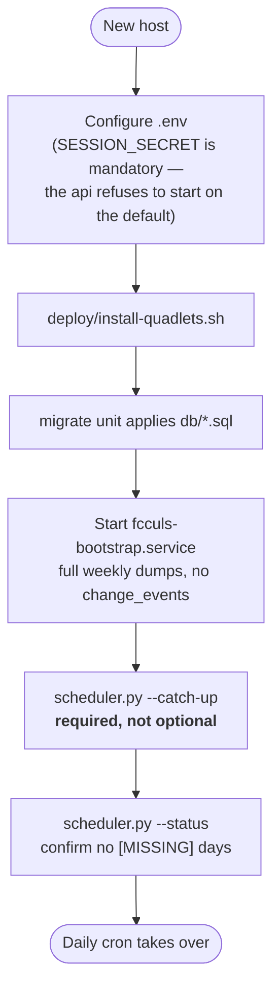

> The weekly dump is cut once a week, so on any day but publication day it
> is **already 1–6 days stale on arrival**. Skipping the `--catch-up` step
> is the single most likely way a new instance silently starts life with a
> data gap and an empty New Hams feed.

### Diagnosing a suspected gap

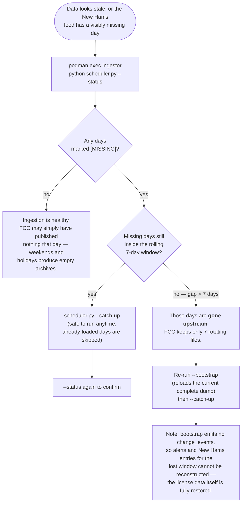

### Backup and restore

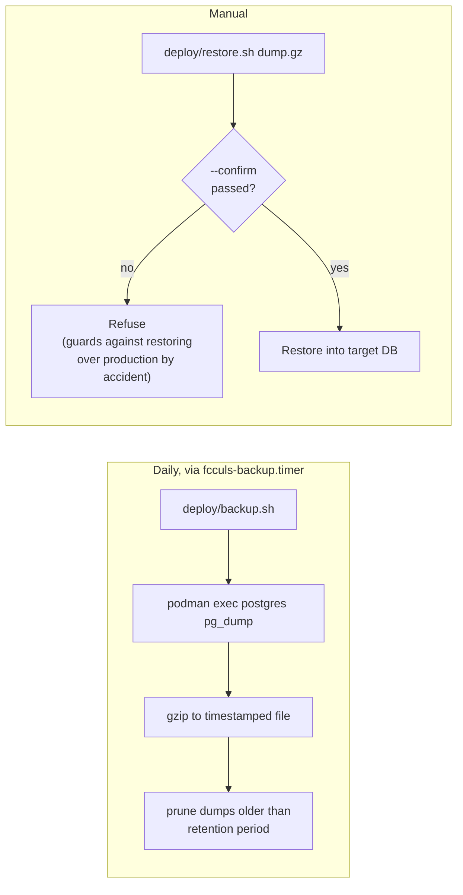

Ingested FCC data is always re-downloadable. **User accounts, watches, and
notification-channel configs are not** — they exist only in Postgres,
which is what the backup protects.
